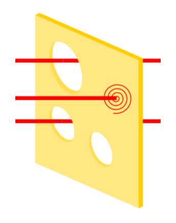

# Herzlichen Willkommen ❤️

## (Frontend) Interview process 🧑‍💻
 **Csaba Tamas**

> Lessons learned from both sides of the table
> What to do and not to do.

<!--
"Hello and welcome, everyone! I’m so glad to see you here today. I am going to talk about an exciting topic—the Frontend Interview Process. This is something that I’ve learned a lot about, both as an interviewer and as someone who’s been on the other side of the table. So today, I want to share some of those insights with you. Let’s dive in! ❤️

 -->

---

## About me 🧔🏻‍♂️
👨‍💻 Frontend Architect

🅰️ Angular contributor

🥷 Working on large-scale projects

🏋️‍♀️Powerlifter competitor


<!--
Let me quickly introduce myself.
👨‍💻 I’m a frontend architect from Hungary 🇭🇺 mostly I working with large codebases (more MLOC).
I used lot of web based technoligies, like webcrypto or webassambly..., 
-->

---
<!-- _class: invert -->

# Slides 🎞️
- You can download my slides just scan the QR code
- **Marp**: markdown presentation ecosystem from **Yuki Hattori** 🇯🇵
- It is a powerful TypesSript based framework, that enables you to create stunning slides effortlessly.


<!--

Before I start the presentation I woudl like to share my slides, so if you donwload my presentaion you can check all the links and yotube vidos.

By the way, these slides are made with Marp, a TypeScript-based framework created by Japanese developer Yuki Hattori.


-->

---


# Today topics and why I am here? 🇨🇭

Personal motivation 👼.

This presentation consists of II parts:

1. What you can do to became perfect applicant, from the first round to the final stages.
2. Tips on organizing interviews select candidate and providing constructive feedback.

I try to give you the most of the takeaways what I can


<!--

This presentation is split into two main parts:

Walkthrough of the interview process, covering each step from the first round to the final stages.
Tips on organizing interviews select candidate and providing constructive feedback.

-->

---
 
 # First part. 

 What you can do to became perfect applicant 💪

---

# Current situation 🧑‍💻
- **Job market is more competitive than ever**: because of the massive layoffs significantly increased the competition.
- Juniors are now competing with experienced engineers (companies don't want to hire juniors) 😢
- Top of that companies are increasingly outsourcing jobs to lower cost regions like India and Eastern Europe (for examle: Poland)
- Less and less remote possibilities, companies prefer hybrid work
- AI is impacting everything


but I like the challanges 🥊
<!-- _footer: More details about the problems here - https://youtu.be/SNZ8tydEMM4?si=98KavuYeEJulT4XS -->


<!--

Let’s start by talking about the current job market. It’s more competitive than ever. Due to the massive layoffs in recent years, there are now more candidates than ever vying for frontend positions.

Junior developers, in particular, are now competing with experienced engineers. Some companies, frankly, don’t want to hire juniors anymore. Also, there’s a growing trend of outsourcing to lower-cost regions, like Poland, India, and Eastern Europe. And to top it all off, many companies are offering hybrid roles, making it harder for those looking for fully remote positions.

And let’s not forget, AI is impacting everything, now mostly it is part of the CV screening process

But, I love a good challenge, let's see what we can do! 🥊"

-->

---

# Let's start with the the first round -> your CV 📝
- CV is more important than ever. It is the key of the first door.
- Due to the large number of applicants, the first stage of the selection process will be based on your CV.
- Sometimes, even if the job description matches your CV, it’s not enough to move to the next stage.

<br><br>
I don't like to filter people by CV, pls do not do it 🙏, details later.

<!--
So, let’s start with the first round—your CV. The CV is more important than ever. It’s the first key of your future job, and because of the large volume of applicants, most companies will start by filtering through CVs before anything else.

I personally don’t like filtering people based on their CV, but I know many companies do, if you can influnece the HR pls do not do it.  I’ll explain why in just a moment."

 -->

---
# Here comes the AI 🤖

- Avoid complicated layouts, tables, or images.
- Text-based content only, avoid graphics, logos, or embedded visuals that AI might misinterpret.
- Stick to common fonts (e.g., Arial, Calibri) and avoid special characters.
- Save your CV as a PDF and use a professional file name, such as `Firstname_Lastname_Frontend_CV.pdf`.
- Stick to simple headings (e.g., Work Experience, Skills, Education).
- Use a single-column format for better parsing.

<!--

Let’s talk about AI—because AI is now part of the CV screening process. When you send your CV, there’s a good chance it’ll go through an AI system that reads and processes it before it ever reaches a human. So, what does AI like?

Simple formatting: Avoid complicated layouts or tables.
Stick to text-based content, no fancy graphics or logos.
Use common fonts like Arial or Calibri, and avoid special characters that AI might misinterpret.
Save your CV as a PDF with a professional file name, something like Firstname_Lastname_Frontend_CV.pdf.
Use clear, simple headings like Work Experience, Skills, Education.
These small things can make a huge difference."

 -->

---

# AI and HR likes content ✍️

- Write a good introduction about yourself
- Modify your resume to the job description. Include relevant technical skills to the job.
- Identify key skills (e.g., React, TypeScript) and buzzwords mentioned in the listing.
- Use natural language to integrate keywords into sentences.
- Include technical and soft skills relevant to the job. <br>For example: "Frontend Frameworks: React | State Management: Redux."
- Focus on quantifiable achievements: "Redesigned a dashboard using Angular, reducing load time by 25%."
- Mention courses like "Google UX Design,"  or relevant AI/ML topics.

<!-- _footer: Good and open source tool to create CV: [Open-Resume](https://www.open-resume.com/) -->

<!--
Let’s talk about what AI is actually looking for. It loves relevant content. Here are some things you can do to optimize your CV:

Write a short, compelling introduction about yourself.
Tailor your CV to match the job description. Highlight the relevant technical skills and buzzwords.
Quantify your achievements where possible. For example, ‘Redesigned a dashboard using Angular, reducing load time by 25%.’ Numbers speak volumes.
Mention relevant courses like Google UX Design or AI/ML courses.
This approach will ensure that AI gives your CV the green light."

-->

---
<!-- _class: invert -->
## How you can scan your CV with llama_index?
```javascript
from llama_index.core.llama_pack import download_llama_pack

ResumeScreenerPack = download_llama_pack(
    "ResumeScreenerPack", "./resume_screener_pack"
)

resume_screener = ResumeScreenerPack(
    job_description=meta_jd,
    criteria=[
        "2+ years of experience in one or more of the following areas: machine learning, recommendation systems, pattern recognition, data mining, artificial intelligence, or related technical field",
        "Experience demonstrating technical leadership working with teams, owning projects, defining and setting technical direction for projects",
        "Bachelor's degree in Computer Science, Computer Engineering, relevant technical field, or equivalent practical experience.",
    ],
)

response = resume_screener.run(resume_path="jerry_resume.pdf")

for cd in response.criteria_decisions:
    print(cd.reasoning)
    print(cd.decision)
print("#### OVERALL REASONING ##### ")
print(str(response.overall_reasoning))
print(str(response.overall_decision))

/*
Jerry Liu has more than 2 years of experience in machine learning and artificial intelligence. 
He worked as a Machine Learning Engineer at Quora Inc. 
for a year and has been an AI Research Scientist at Uber ATG since 2018. His work involves deep learning, information theory, and 3D geometry, among other areas.
True
/*

```

<!-- _footer: I subscibed all the AI resume chacker app maybe the best: https://jobscan.co/ -->

---

# Secound round -> let pass through the HR person 👩‍💼
- If you have good soft skills the most of the time this round is easy.
- It is important to highlight the relevant skills and experiences
- Avoid too much technical jargon, focus on how your skills that benefit.
- You don't need to much preparation, but worth it to check the the companies website.
- Be ready to answer questions like:
  - Why do you want to work here?
  - What are your strengths/weaknesses?
  - Can you describe a challenge you’ve overcome?
  - Can you give the salary range what fit for you?
- Maintain good body language and **be kind**. 🤗


<!--
Alright, once you pass through the CV filter, you’ll likely have an HR interview. Now, this round is more about soft skills and cultural fit. If you’ve got good soft skills, this round can be quite easy.

Some things to keep in mind:

Prepare for common questions like:
Why do you want to work here?
What are your strengths/weaknesses?
Can you describe a challenge you’ve overcome?
What salary range fits you?
Good body language is key—be kind and engage positively.
It’s more about presenting yourself as someone who can collaborate well with the team."

 -->


---

# Third round  -> The first techical interview 🧑‍💻
- It's important to check the types of interviews (on [glassdoor](https://www.glassdoor.com/)).
  - Big Fang tech companies primarily focus on data structure and algorithm coding interviews ->  [LeetCode](leetcode.com), [HackerRank](hackerrank.com)
  - Smaler companies (like random local bank) like traditional techical interview, like talk about JavaScript basics, networking, frameworks etc... -> [Front End Interview Handbook](https://frontendinterviewhandbook.com)
- You have to prepare, but if you are familiar with the process it is much more stress free
- Be up-to-date with the latest technologiest and try to prepare

<!-- _footer: Tip: Follow youtube channels like [t3dotgg](https://www.youtube.com/@t3dotgg) [ThePrimeTimeagen](https://www.youtube.com/@ThePrimeTimeagen), [Fireship](https://www.youtube.com/@Fireship) and [adorablestarskittens2436](https://www.youtube.com/@adorablestarskittens2436)
 -->

<!--
 Now let’s move on to the third round, the technical interview. Depending on the company, this could focus on:

Data structures and algorithms, especially in Big Tech companies (think Google, Facebook, etc.). You’ll likely encounter challenges on LeetCode or HackerRank.
For other companies, expect questions around JavaScript basics, networking, or frontend frameworks like React or Angular.
Preparation is key here. Stay up to date with the latest technologies and don’t neglect the basics. Familiarity with the process will make things less stressful.

 -->

---


# X round of coding/techical interviews 🥷

### What to do:

- Take your time to read and clarify the question. (look all the source files)
- Communicate your thought, this shows your problem-solving skills, even if you don’t get the perfect solution.
- Write pseudocode or draw component first structure before you writing code.
- If you get stuck, stay calm and positive and share how you’re trying to debug or rethink the solution.

<!--

"Let’s talk about what you should do in the coding interview:

Take your time to read and clarify the question before jumping into code.
Ask questions if you’re unclear on the requirements. For example, what are the edge cases?
Communicate your thought process—this shows problem-solving skills.
Outline your solution before coding—whether it's pseudocode or a component diagram.
If you get stuck, stay calm, positive, and share how you’re tackling the problem.
Remember, it’s not just about the final answer but about how you approach the problem."

-->

---

# X round of coding/techical interviews 🥷

### What not to do
- Don't have to show yourself an expert in everything
- Don’t overcomplicate, start with a simple solution and iterate if needed.
- Don’t ignore time limits, keep an eye on time and prioritize completing a basic solution.

<br><br><br><br><br><br><br>

<!--
And now, what not to do:

Don’t pretend to know everything. You don’t need to be an expert in everything, just be honest.
Avoid overcomplicating the solution. Start with something simple, then iterate if needed.
Don’t ignore time limits—prioritize completing a basic solution over a perfect one.
Remember, the goal is to show that you can think critically and solve problems effectively."

-->

---


# Final round with the CTO or team fit 🧘

Just relax and be yourself. At this stage, the decision is out of your hands.

<!--

Finally, the last round is often with the CTO or the team. This is usually the final step, and at this point, the decision is largely out of your hands. My advice here is simple: just relax and be yourself. Let your personality and passion for development shine through.

-->

---
 
 # Secound part.

 Let's see the other side of the table 🏓

---


### How I do the interview process 🧑‍💻

- It is not my method, but I modified for my needs.
- I don’t like filtering by CV. I prefer filtering by attitude. 🥰
- Send the interview methods to all the candidates. (traditional, realistic, show yourself)
- I like to start with interesting project 👀


<!-- _footer: My method based on: https://t3-tools.notion.site/Technical-Interview-Dan-Abramov-9aa6d8e9292e4bd1ae67b44aeeaabf88 -->

<!-- 
Now, a little about how I conduct interviews. My process is a bit different. I don’t like filtering by CV. Instead, I focus on attitude—I want to see if someone is passionate and willing to learn. I’ll send the candidates my interview approach so they know what to expect.

I also like to start with an interesting project to discuss. It’s not just about technical skills, but also about the ability to communicate and collaborate."

-->

---


### How I do lead the technical interview 🧑‍💻

- Start with fundamental questions, for me it is more important to know than knowledge of the framework
- Easy questions first (good to relax the candidate) and ask deeper and deeper informations. 
- The interviewer problem-solving abilities is more important than the exact answer
- Ask open-ended questions that encourage discussion and allow the candidate to explain their approach.
- Look for clean code, adaptability, and genuine passion for frontend development.

<!-- 
During the technical interview, I focus on fundamentals. It’s not about knowing every framework; it’s about understanding the core concepts and how you approach problems.

I prefer easy questions first to help the candidate relax, then I dive deeper. I look for clean code, adaptability, and genuine passion for frontend development."
-->

---

### How I like to commonicate 🤗

- Pls do not send: *we have decided not to move forward with your application* oneliner
- If you pick or filter someone, please provide the exact reason, **transparent commonication is priceless**
- Give a chance to prove

I like to write:

- Sorry to inform you, but we move forward with candidates who have more open source projects
- Sorry to inform you, but we need more experiance with the following technologies: ...., If you feel you are still a suitable candidate, please explain why


<!-- _footer: An other people on redit: https://www.reddit.com/r/careerguidance/comments/gx9vcl/weve_decided_not_to_move_forward_at_this_time_is/ -->

<!--
Lastly, a few words about communication. After an interview, please don’t send a one-liner rejection like, 'We’ve decided not to move forward.' Instead, I make sure to give transparent feedback—whether it’s about the lack of open-source contributions or missing experience in a specific tech stack. I want to give candidates a chance to improve."

-->

---

# Thank you very much!

# 🙋🏻‍♀️ Questions? 🙋🏻


<!--
"Thank you so much for your time today! I hope you learned something valuable about the frontend interview process. If you have any questions, now is the time!"

-->